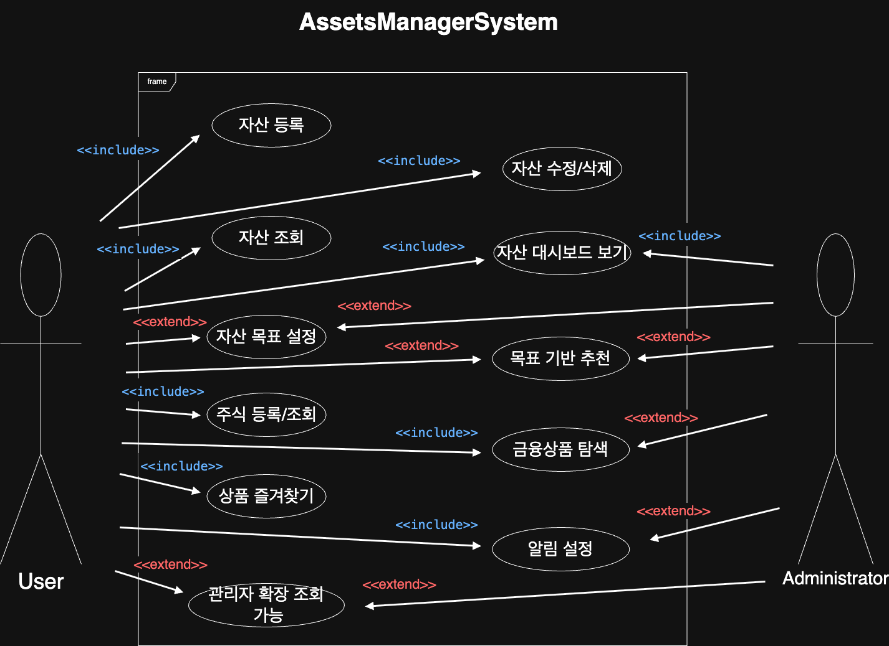

# 📄 자산관리 프로젝트 유즈케이스 상세 정의

> 기준: 컴포넌트 디렉토리 구조 기반 (금융, 포트폴리오, 주식, 홈, 나의 자산, 자산 계획 등)

---

## 🧍 유즈케이스 다이어그램

---

## 🧍 사용자: 일반 사용자 (개인 투자자)

---

## ✅ 유즈케이스 분류 및 상세 목록

### 📁 1. Home (메인 대시보드)
| ID | 유즈케이스 | 설명 |
|----|------------|------|
| UC-H01 | 홈 화면 진입 | 사용자가 로그인 후 대시보드에 접속한다 |
| UC-H02 | 종합 자산 요약 보기 | 전체 자산의 합계 및 변화량을 확인한다 |
| UC-H03 | 빠른 메뉴 이동 | 포트폴리오, 계획, 주식 등으로 빠르게 이동한다 |

---

### 📁 2. MyAssetsData (나의 자산 현황)
| ID | 유즈케이스 | 설명 |
|----|------------|------|
| UC-A01 | 자산 등록 | 사용자가 새로운 자산(현금/예금/부동산 등)을 등록한다 |
| UC-A02 | 자산 수정/삭제 | 등록된 자산 정보를 수정하거나 삭제한다 |
| UC-A03 | 자산 리스트 확인 | 보유 중인 자산들을 테이블 형식으로 확인한다 |
| UC-A04 | 카테고리별 자산 정리 | 자산을 유형별로 필터링한다 (예: 주식만 보기) |

---

### 📁 3. MyAssetsPlan (자산 목표 계획)
| ID | 유즈케이스 | 설명 |
|----|------------|------|
| UC-P01 | 자산 목표 등록 | 목표 이름, 기간, 목표 금액을 입력한다 |
| UC-P02 | 목표 달성 시뮬레이션 | 월 저축/수익률 기준 목표 도달 가능성 확인 |
| UC-P03 | 진행률 시각화 | 달성률을 퍼센트/그래프로 확인한다 |
| UC-P04 | 목표 수정/삭제 | 기존 목표를 편집하거나 삭제한다 |

---

### 📁 4. AssetsStock (주식)
| ID | 유즈케이스 | 설명 |
|----|------------|------|
| UC-S01 | 보유 주식 등록 | 사용자가 보유 중인 주식 종목을 등록한다 |
| UC-S02 | 주가 정보 조회 | 외부 API를 통해 실시간 가격을 확인한다 |
| UC-S03 | 수익률 계산 | 매입가 대비 수익률 및 평가금액을 계산한다 |
| UC-S04 | 주식 상세 보기 | 종목 클릭 시 상세 정보 및 차트를 확인한다 |

---

### 📁 5. AssetsFinance (금융 상품)
| ID | 유즈케이스 | 설명 |
|----|------------|------|
| UC-F01 | 금융상품 목록 조회 | 예/적금, 펀드, 보험 등 외부 연동 상품 목록 확인 |
| UC-F02 | 조건별 필터링 | 금리, 기간, 유형별 필터링 기능 제공 |
| UC-F03 | 즐겨찾기 등록 | 관심 있는 상품을 저장한다 |
| UC-F04 | 상품 비교 기능 | 선택한 여러 상품을 표로 비교한다 |

---

### 📁 6. AssetsPortfolio (포트폴리오)
| ID | 유즈케이스 | 설명 |
|----|------------|------|
| UC-T01 | 전체 자산 비중 보기 | 각 자산 항목별 비중을 차트로 확인한다 |
| UC-T02 | 기간별 변화 추이 확인 | 최근 주/월 단위 자산 변화 시각화 |
| UC-T03 | 자산 구성 최적화 추천 (확장) | 사용자 목표 기반으로 리밸런싱 제안 |

---

## 💡 추가 고려 가능한 유즈케이스
| ID | 유즈케이스 | 설명 |
|----|------------|------|
| UC-G01 | 알림 수신 설정 | 자산 급감, 목표 도달 등 이벤트 알림 설정 |
| UC-G02 | PDF 리포트 생성 | 자산 구성 및 변화 리포트를 PDF로 출력 |
| UC-G03 | 마이데이터 연동 (계획) | Open Banking API로 외부 자산 자동 연동 |

---