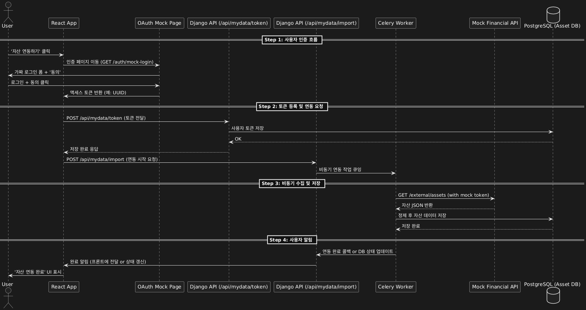
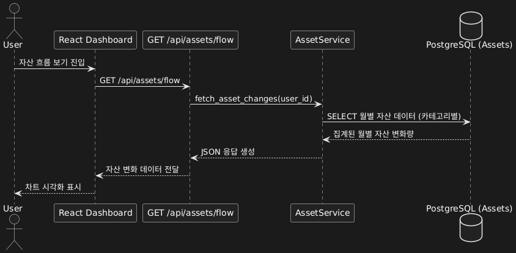
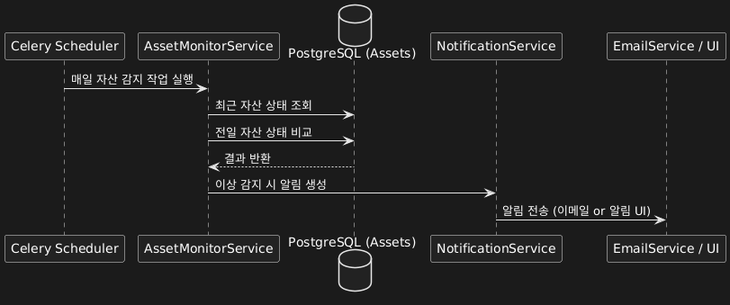
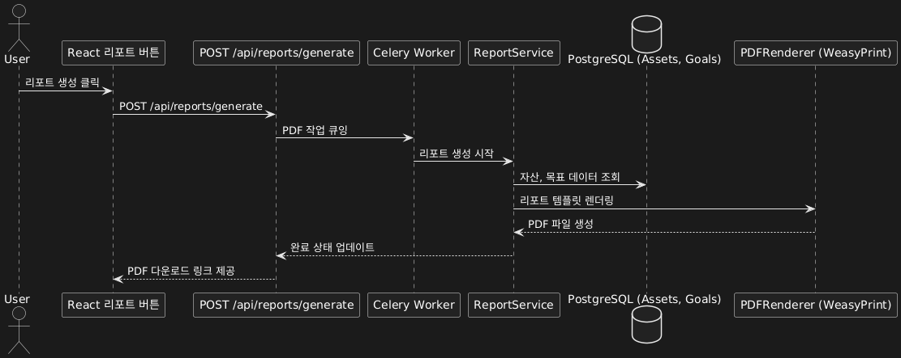
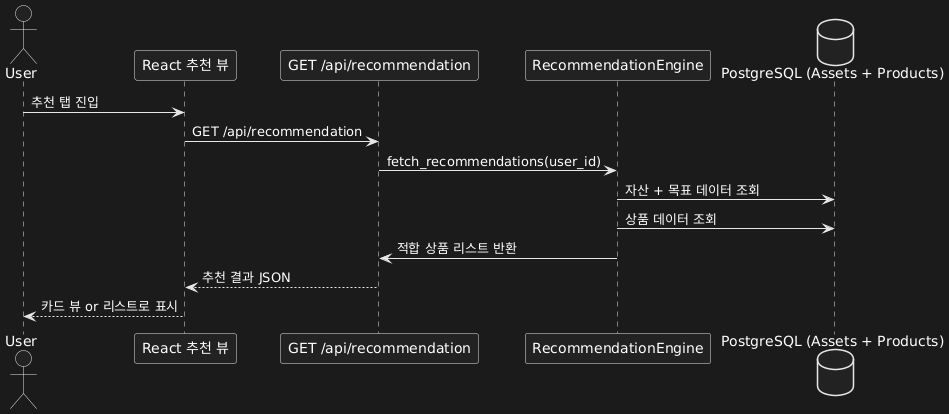
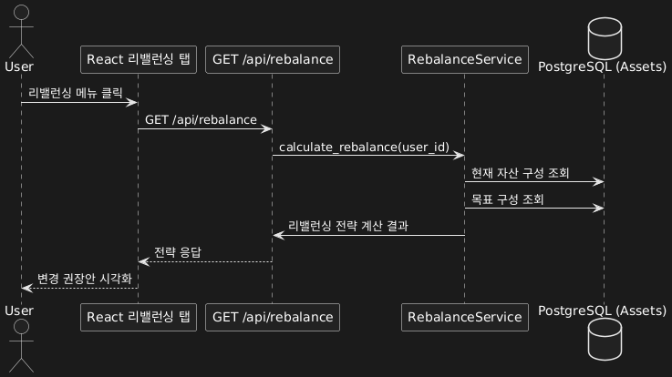

-----------------------------------------------------------------

# 🔄 시퀀스 다이어그램 

-----------------------------------------------------------------

## A1. 외부 금융기관 자산 통합 연동

### A1. 외부 금융기관 자산 통합 연동 시퀀스 다이어그램 

### 화면(screen) 

### 설명(explanation)
- 사용자는 외부 기관과의 연동을 통해 자동으로 자산 데이터를 불러올 수 있다.
- 최초 1회 인증이 필요하며, 이후 토큰 기반으로 수동/자동 동기화가 가능하다.
- 연동된 자산은 내부 DB에 정제되어 저장되고, 자산 대시보드에 실시간 반영된다.

-----------------------------------------------------------------

## A2. 자산 카테고리별 흐름 분석

### A2. 자산 카테고리별 흐름 분석 시퀀스 다이어그램 

### 화면(screen) 

### 설명(explanation)
- 사용자의 자산 변동 추이를 카테고리별로 분석하여 시각화된 데이터로 제공한다.

-----------------------------------------------------------------

## A3. 이상자산 감지 및 알림

### A3. 이상자산 감지 및 알림 시퀀스 다이어그램 

### 화면(screen) 

### 설명(explanation)
- 자산이 급감하거나 특정 임계치를 벗어날 경우 사용자에게 즉시 알림을 전송한다.

-----------------------------------------------------------------

## A4. 전체 자산 요약 리포트(PDF) 생성

### A4. 전체 자산 요약 리포트(PDF) 생성 시퀀스 다이어그램 

### 화면(screen) 

### 설명(explanation)
- 사용자의 자산 상태를 정리하여 PDF 형태로 저장/다운로드할 수 있게 한다.

-----------------------------------------------------------------

## A5. 맞춤형 금융 상품 추천

### A5. 맞춤형 금융 상품 추천 시퀀스 다이어그램 

### 화면(screen) 

### 설명(explanation)
- 사용자의 현재 자산 구성과 목표에 따라 적합한 금융 상품을 추천한다.

-----------------------------------------------------------------

## A6. 자산 리밸런싱 제안

### A6. 자산 리밸런싱 제안 시퀀스 다이어그램 

### 화면(screen) 

### 설명(explanation)
- 현재 자산 구성과 목표 구성의 차이를 비교하여 리밸런싱 전략을 제안한다.

-----------------------------------------------------------------