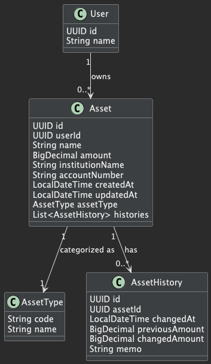
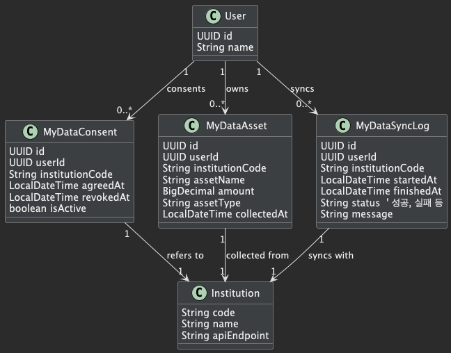
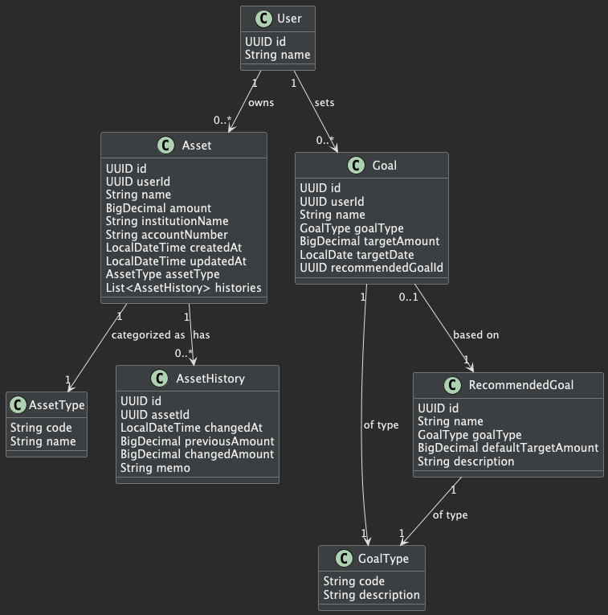
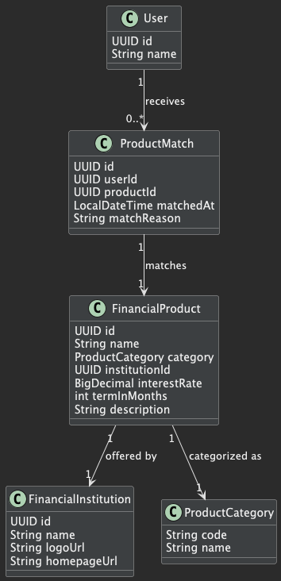
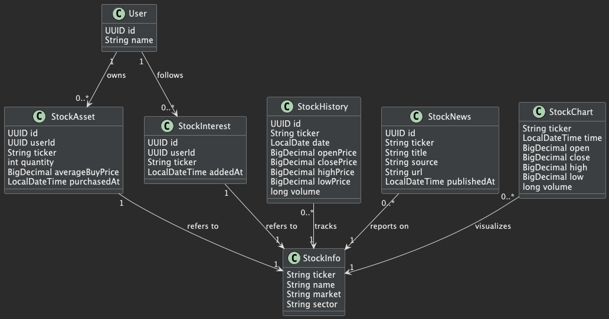

-----------------------------------------------------------------

# 🦙 클래스 다이어그램

-----------------------------------------------------------------

-----------------------------------------------------------------

## B1. 자산 관리 클래스 다이어그램 

### 화면(screen) 

### 설명(explanation)

-----------------------------------------------------------------

## B2. 마이 데이터 클래스 다이어그램 

### 화면(screen) 

### 설명(explanation)

-----------------------------------------------------------------

## B3. 마이 데이터 계획 클래스 다이어그램 

### 화면(screen) 

### 설명(explanation)

-----------------------------------------------------------------

## B4. 금융 클래스 다이어그램 

### 화면(screen) 

### 설명(explanation)

-----------------------------------------------------------------

## B5. 주식 클래스 다이어그램 

### 화면(screen) 

### 설명(explanation)

-----------------------------------------------------------------