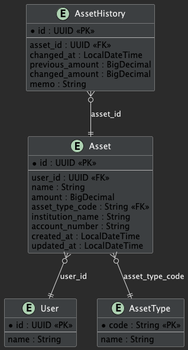
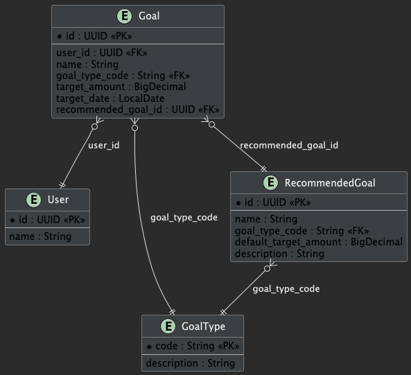
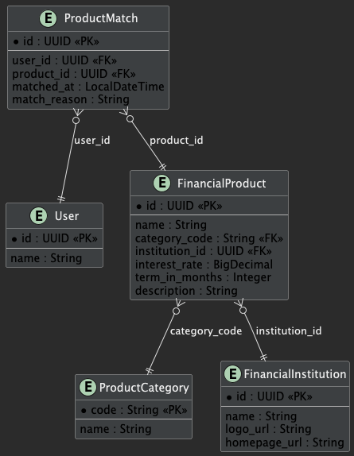
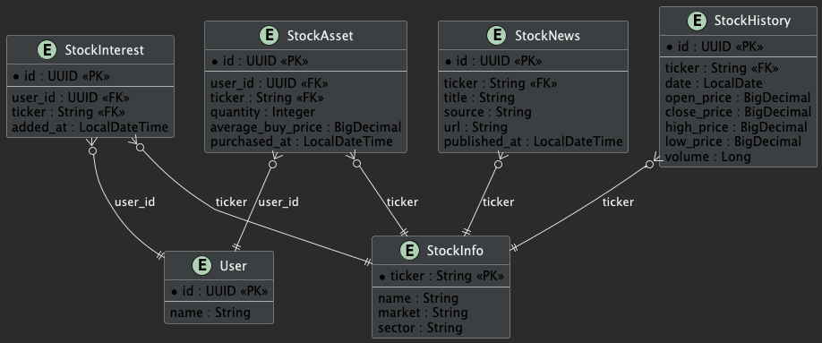

-----------------------------------------------------------------

# 🐍 ERD

-----------------------------------------------------------------

-----------------------------------------------------------------

## C1. 자산관리  ERD

### 화면(screen) 

### 설명(explanation)

-----------------------------------------------------------------

## C2. 마이데이터  ERD

### 화면(screen) 

### 설명(explanation)

-----------------------------------------------------------------

## C3. 마이데이터계획  ERD

### 화면(screen) 

### 설명(explanation)

-----------------------------------------------------------------

## C4. 귬융  ERD

### 화면(screen) 

### 설명(explanation)

-----------------------------------------------------------------

## C5. 주식  ERD

### 화면(screen) 

### 설명(explanation)

-----------------------------------------------------------------